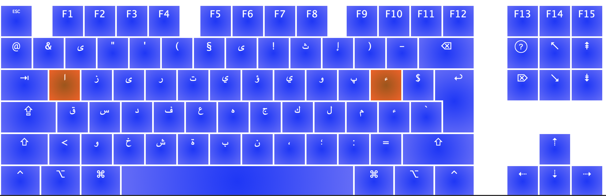
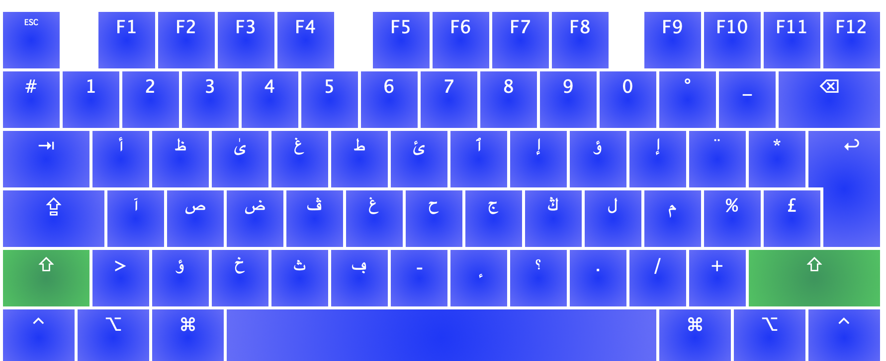
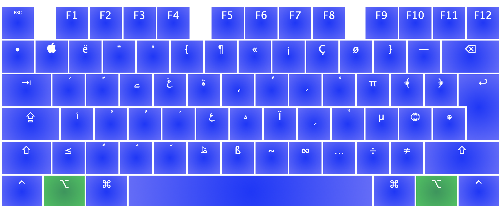
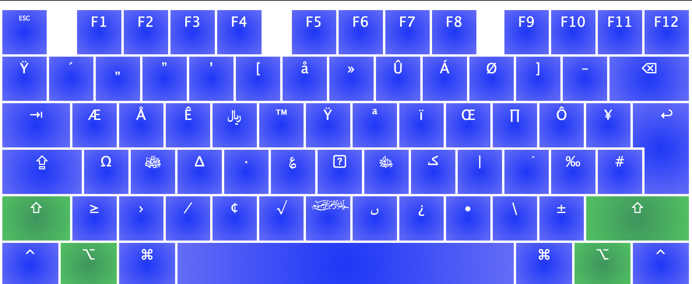
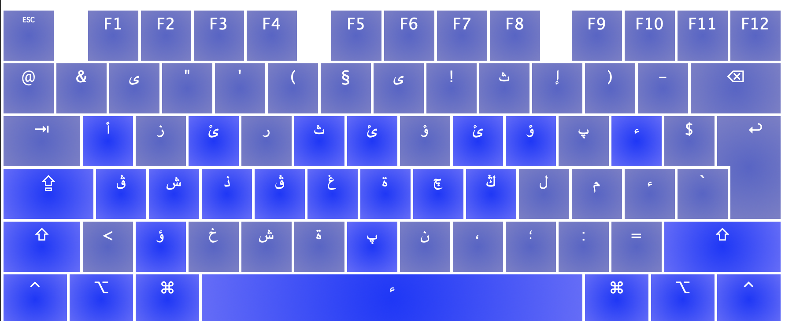

Arabic Phonetic AZERTY Keyboard Layout
======================================

    تخطيط لوحة المفاتيح لنظام الماك يقابل كل حرف مع الزر الأقرب لفظا 

A phonetic keyboard layout for Mac OS compatible with AZERTY keyboards, makes it easier to type in arabic with an AZERTY keyboard.

Inspired by:
* Arabic Phonetic Keyboard by omaralzabir (QWERTY): http://arabic.omaralzabir.com/
* Lexilogos online arabic keyboard: https://www.lexilogos.com/clavier/araby.htm

Made using [Ukelele](http://software.sil.org/ukelele/) for Mac os.

What you need to remember:
* every key is mapped to the closest sounding arabic letter, use `shift` for second closest, example `h` → `هـ` / `shift + h` → `ح`
* `^` → ء
* `^ + a / i / w / y` → ئ ؤ إ أ
* `^ + t / d / g / k / ...` →  ڭ غ ذ ث ...
* `opt + a / i / u / o` → سكون / كسرة / ضمة / فتحة ...

لائحة الحروف
-----------
# بدون أزرار التغيير

# مع زر `shift`

# مع زر `option` حركات : (◌َ ◌ُ ◌ِ ◌ْ ◌ََ ◌ِِ ◌ٌ ◌ّ)

# مع زري `option`+`shift`: مختصرات ( ﷽ ﷻ ﷺ  ...)

# بعد الضغط على زر `^`: حروف مهموزة أو معجمة (أ إ ئ ڭ ڨ ...)

| الحرف أو الرمز العربي | الزر المقابل في لوحة المفاتيح |
|-----------------------|-------------------------------|
| ا                     | `a`                           |
| ب                     | `b`                           |
| ت                     | `t`                           |
| ث                     | `^ t` or `ç`                  |
| ج                     | `j`                           |
| ح                     | `H`                           |
| خ                     | `x` or `^ H`                  |
| د                     | `d`                           |
| ذ                     | `^ d`                         |
| ر                     | `r`                           |
| ز                     | `z`                           |
| س                     | `s`                           |
| ش                     | `c` or `^ s`                  |
| ص                     | `S`                           |
| ض                     | `D`                           |
| ط                     | `T`                           |
| ظ                     | `Z`                           |
| ع                     | `g`                           |
| غ                     | `G` or `^ g`                  |
| ف                     | `f`                           |
| ق                     | `q`                           |
| ك                     | `k`                           |
| ل                     | `l`                           |
| م                     | `m`                           |
| ن                     | `n`                           |
| ه                     | `h`                           |
| ة                     | `v` or `^ h`                  |
| و                     | `w` or `o`                    |
| ي                     | `i` or `y`                    |
| ىٰ                     | `E`                           |
| ى                     | `e` or `é`                    |
| ـ                     | `B`                           |

الهمزة
------

| الحرف أو الرمز العربي | الزر المقابل في لوحة المفاتيح |
|-----------------------|-------------------------------|
| ء                     | `^` or `^^`                   |
| أ                     | `A` or `^ a`                  |
| إ                     | `I` or `^ i`                  |
| آ                     | `aa`                          |
| ئ                     | `Y` or `^ y`                  |
| ؤ                     | `W` or `^ w`                  |
| ٱ                     | `U`                           |

حركات
-----

| الحرف أو الرمز العربي | الزر المقابل في لوحة المفاتيح  |
|-----------------------|--------------------------------|
|◌َ  (فتحة)              | `opt + a` or `opt + f`         |
|◌ُ  (ضمة)               | `opt + u` or `opt + d`         |
|◌ِ  (كسرة)              | `opt + i` or `opt + k`         |
|◌ْ  (سكون)              | `opt + o` or `opt + s`         |
|◌ََ  (فتحتين)            | `opt + aa`                     |
|◌ِِ  (كسرتين)            | `opt + ii` or `opt + y`        |
|◌ٌ  (ضمتين)             | `opt + w`                      |
|◌ّ  (شدة)               | `opt + c`  or `opt + z`        |

اختصارات و رموز موحدة
---------------------

| الحرف أو الرمز العربي               | الزر المقابل في لوحة المفاتيح |
|-------------------------------------|-------------------------------|
| ﷻ                                   | `opt + shift + j`            |
| ﷺ                                  | `opt + shift + s`             |
| ﷽                         | `opt + shift + b`             |
| ﷼                                   | `opt + shift + r`             |
